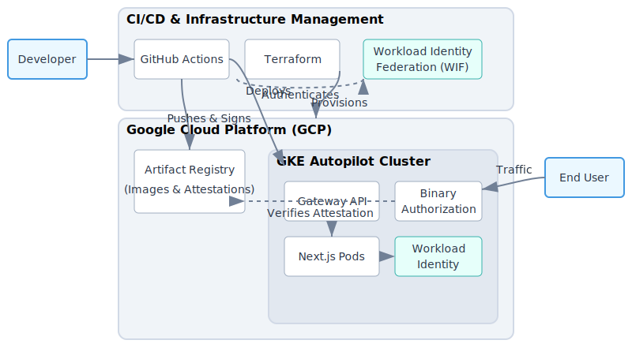
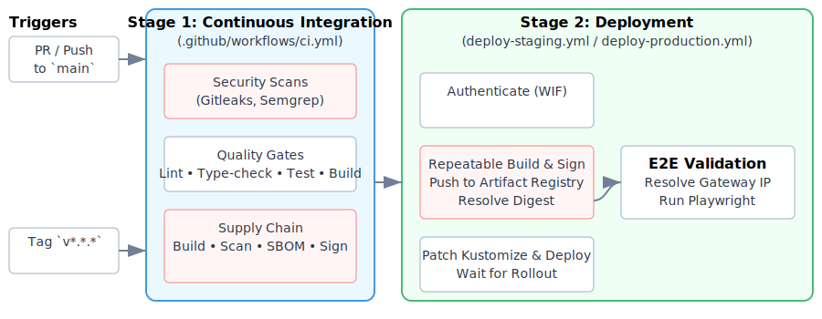

# AI Dev Platform

**A secure, production-ready foundation for deploying AI-oriented applications to Google Kubernetes Engine (GKE) Autopilot.**

The AI Dev Platform is a comprehensive monorepo that bundles a modern Next.js 14 application, shared TypeScript tooling, Terraform-based infrastructure, and automated CI/CD pipelines. It is designed with a security-first approach, integrating supply-chain scanning, binary authorization, and end-to-end validation to ensure robust and reliable deployments.

## Key Features

- **Modern web stack:** Next.js 14 (App Router), React 18, and Tailwind CSS v4.
- **GKE Autopilot delivery:** Automated Kubernetes deployments via Kustomize and Gateway API routing.
- **Infrastructure as Code:** GCP infrastructure managed entirely by Terraform (GKE, networking, Workload Identity Federation, Artifact Registry).
- **Secure CI/CD:** GitHub Actions workflows authenticate to GCP via Workload Identity Federation for keyless operations.
- **Supply-chain security:** Integrated scanning (Trivy, Grype), SBOM generation (Syft), and keyless signing (Cosign).
- **Binary Authorization:** Enforced in GKE so only signed and attested images are admitted.
- **Comprehensive testing:** Jest + Testing Library unit tests and Playwright E2E tests wired into the delivery pipeline.
- **Monorepo ergonomics:** PNPM workspaces and Turbo coordinate builds, tests, and shared tooling.
- **Security guardrails:** Gitleaks, Semgrep, CodeQL, and centralized ESLint rules (security + SonarJS) run locally and in CI.

## Architecture Overview

This platform leverages GKE Autopilot for managed Kubernetes, using the Gateway API for external traffic management. Infrastructure is composed with Terraform modules and applied per environment (staging and production). Deployments rely on Kustomize overlays that inject immutable image digests and Workload Identity bindings. GitHub Actions authenticates through Workload Identity Federation (WIF) to push signed images to Artifact Registry and apply manifests to GKE, where Binary Authorization enforces attestation policies.



## Repository Map

The codebase is organized as a PNPM workspace managed by Turbo.

```
.
├── apps/
│   └── web/                  # Next.js 14 App Router application (Tailwind v4, Jest, Playwright)
├── deploy/
│   └── k8s/                  # Kustomize manifests
│       ├── base/             # Shared Kubernetes resources (Deployment, Service, Gateway, HTTPRoute)
│       └── overlays/         # Environment-specific patches (staging, production)
├── docs/                     # Architecture, security, onboarding, runbooks
├── infra/
│   └── terraform/            # Infrastructure as Code
│       ├── envs/             # Environment configurations (staging, production)
│       └── modules/          # Reusable modules (GKE, network, services, WIF)
├── packages/
│   ├── eslint-config-custom/ # Centralized ESLint rules (TypeScript, security, SonarJS)
│   └── tsconfig/             # Shared TypeScript presets
├── scripts/                  # Operational helpers (onboarding, infra bootstrap, CI/CD helpers, supply chain tooling)
├── .github/
│   └── workflows/            # CI/CD pipelines (CI, deploy, Terraform, CodeQL, security validation)
└── turbo.json                # Turbo configuration
```

## Technology Stack

- **Frontend:** Next.js 14 (App Router), React 18, TypeScript, Tailwind CSS v4.
- **Testing:** Jest, React Testing Library, Playwright.
- **Tooling:** PNPM workspaces, Turbo, ESLint, Prettier, Husky, Commitlint.
- **Infrastructure:** Terraform, GKE Autopilot, Artifact Registry, VPC networking, Workload Identity Federation.
- **DevOps:** Kustomize, Gateway API, Docker (distroless runtime).
- **Security:** Cosign, Syft, Grype, Trivy, Gitleaks, Semgrep, CodeQL, GCP Binary Authorization.

## Getting Started

### Step 1: Prepare Windows and clone the repository

Install Git (and the supporting shell tools) on Windows if the machine is brand new:

- Open an elevated PowerShell window and run:
  ```powershell
  winget install --id Git.Git -e --source winget
  ```
  Accept any prompts, then restart PowerShell so `git` is on `PATH`. If winget is unavailable, download Git for Windows from https://git-scm.com/download/win and rerun PowerShell.

After Git is ready, create a working directory at `C:\\dev` (if it does not already exist), clone the repository into it (or fast-forward it if it already exists), and switch into the project folder. The following PowerShell block is idempotent—rerunning it will simply update the checkout:

```powershell
$workspace = 'C:\dev'
$repoPath = Join-Path $workspace 'ai-dev-platform'
New-Item -ItemType Directory -Force -Path $workspace | Out-Null
Set-Location $workspace

if (Test-Path (Join-Path $repoPath '.git')) {
  Set-Location $repoPath
  git fetch origin
  git checkout main
  git pull --ff-only origin main
} elseif (Test-Path $repoPath) {
  throw "Path $repoPath already exists but is not a Git repository. Move or remove it, then rerun this block."
} else {
  git clone https://github.com/swb2019/ai-dev-platform.git
  Set-Location $repoPath
}
```

If Git cannot be installed (for example, on tightly managed devices), download the repository ZIP from GitHub, extract it under `C:\\dev\\ai-dev-platform`, and continue inside that folder. To refresh the code later, replace the extracted folder with a fresh ZIP or convert it into a Git clone.

### Step 2: Run the automated setup (Windows)

- **Windows helper**

  ```powershell
  powershell -ExecutionPolicy Bypass -File .\scripts\windows\setup.ps1 [-DockerInstallerPath C:\path\to\DockerDesktopInstaller.exe]
  ```

  Launches WSL2 (if needed), sets the default distro, provisions Docker Desktop with WSL integration, clones this repository into Linux, and invokes `./scripts/setup-all.sh`. On brand-new installations it seeds the default Linux user automatically, so no interactive username/password prompts block the run. The helper is idempotent: re-running the command resumes from the recorded checkpoints in `tmp\setup-all.state`, fast-forwards the Git checkout, and skips work that already succeeded. Use `-RepoSlug your-user/ai-dev-platform` or `-Branch feature` to target a fork/branch. Provide `-DockerInstallerPath` or set `DOCKER_DESKTOP_INSTALLER` when operating in offline or proxy-restricted environments.

- **Already inside WSL (optional manual run)**

  ```bash
  ./scripts/setup-all.sh
  ```

  Run this from the repository root inside WSL if you prefer to execute the consolidated setup manually. The wrapper installs OS-level packages with `apt`, ensures Node.js/pnpm/gh/gcloud/terraform, validates Docker availability (via Docker Desktop integration), runs onboarding, infrastructure bootstrap, repository hardening, and verifies the workspace (`docker info`, `pnpm lint`, `pnpm type-check`, `pnpm --filter @ai-dev-platform/web test`). Each stage records its completion, so rerunning `./scripts/setup-all.sh` is safe: it reuses prior results, retries only the failed step, and leaves a summary in `tmp/setup-all.state`. Set `RESET_SETUP_STATE=1 ./scripts/setup-all.sh` to force a full rerun. Additional knobs include `SKIP_POST_CHECKS=1` to skip verification, `POST_CHECK_MAX_RETRIES=5` (for example) to allow extra recovery attempts, `DOCKER_DESKTOP_INSTALLER` for offline Docker Desktop installs, and log capture under `tmp/postcheck-*.log`.

### Manual prerequisites (fallback)

The automated script handles prerequisites whenever it has the required permissions, package manager, and network access. If it reports that a dependency must be installed manually (common on managed corporate laptops or air-gapped environments), provision the following and re-run `./scripts/setup-all.sh` afterward:

1. **Node.js 20.x and pnpm 9** – enable Corepack and activate pnpm 9.12.0:
   ```bash
   corepack enable && corepack prepare pnpm@9.12.0 --activate
   ```
2. **Docker** – install Docker Desktop/Engine and ensure the daemon responds to `docker info`.
3. **Google Cloud CLI (`gcloud`), Terraform CLI, GitHub CLI (`gh`)** – authenticate against the target GCP project and GitHub organization.
4. **Playwright system dependencies** – install once locally for browser automation:
   ```bash
   pnpm --filter @ai-dev-platform/web exec playwright install --with-deps
   ```

After the prerequisites are satisfied, re-run `./scripts/setup-all.sh` to perform onboarding, infrastructure bootstrap, hardening, and verification.

### Additional scripts

1. **Bootstrap infrastructure (optional standalone)**
   ```bash
   ./scripts/bootstrap-infra.sh
   ```
   Initializes Terraform backends, enables required GCP services, configures Workload Identity Federation, and offers applies per environment.
2. **Configure GitHub environments**
   ```bash
   ./scripts/configure-github-env.sh staging
   ./scripts/configure-github-env.sh prod
   ```
   Populates GitHub environment secrets/variables (e.g., WIF provider, Artifact Registry, GKE cluster metadata) from Terraform outputs.

### Local Development

Use pnpm filters to target the web application:

- **Run the web app**
  ```bash
  pnpm --filter @ai-dev-platform/web dev
  ```
- **Linting and type checking**
  ```bash
  pnpm lint
  pnpm type-check
  ```
- **Testing**
  ```bash
  # Unit tests
  pnpm --filter @ai-dev-platform/web test
  # E2E tests (Playwright starts a dev server when E2E_TARGET_URL is unset)
  pnpm --filter @ai-dev-platform/web test:e2e
  ```
- **Build the application**
  ```bash
  pnpm --filter @ai-dev-platform/web build
  ```

## CI/CD Pipeline

GitHub Actions enforces quality and security before any deployment.

1. **Continuous Integration (`.github/workflows/ci.yml`)**
   - Security scans: Gitleaks and Semgrep.
   - Quality gates: `pnpm install --frozen-lockfile`, lint, type-check, unit tests, build, format check.
   - Supply chain: build container, scan (Trivy/Grype), generate SBOM (Syft), sign (Cosign).
2. **Deployment (`deploy-staging.yml`, `deploy-production.yml`)**
   - Authenticates to GCP via Workload Identity Federation.
   - Rebuilds and signs the image, pushes to Artifact Registry, resolves the immutable digest.
   - Patches Kustomize overlays with the digest and Workload Identity annotation, applies manifests to GKE, waits for rollout.
   - Runs Playwright E2E tests against the live Gateway endpoint (staging always; production workflows can be extended similarly).



## Supply Chain Security

The platform applies rigorous supply-chain controls to preserve artifact integrity:

1. **Scanning:** Trivy and Grype run during CI and fail the pipeline on High/Critical (Trivy) or High (Grype) findings.
2. **SBOM generation:** Syft produces CycloneDX SBOMs that are uploaded as workflow artifacts.
3. **Keyless signing:** Cosign uses GitHub Actions OIDC (via WIF) to sign images and attest the SBOM with no long-lived keys.
4. **Binary Authorization:** GKE Autopilot clusters enforce Binary Authorization, allowing only signed and attested images to run.
5. **Immutable images:** Deployment workflows resolve tags to immutable digests and patch Kustomize overlays before applying manifests.

Developers can run the same steps locally with:

```bash
./scripts/container/supply-chain.sh build
./scripts/container/supply-chain.sh scan
./scripts/container/supply-chain.sh sbom
./scripts/container/supply-chain.sh sign
```

## Development Workflow

This project enforces a consistent workflow to maintain quality, security, and reproducibility:

1. **Branching:** Create feature branches from `main`; never commit directly to protected branches.
2. **Commits:** Follow Conventional Commits (`commitlint` enforces format).
3. **Pre-commit hooks:** Husky runs `gitleaks protect --staged` and `lint-staged` (ESLint + Prettier) on staged files.
4. **Pre-push hooks:** Verify editor extension lock consistency and capture git sync status.
5. **Pull requests:** Use the helper script to validate, push, and open PRs with auto-merge enabled:
   ```bash
   ./scripts/push-pr.sh
   ```
6. **Monitor merges:** Track PR status until merge (or failure) to ensure required checks pass:
   ```bash
   ./scripts/monitor-pr.sh
   ```
7. **Editor extensions:** Keep AI assistant extensions aligned across contributors:
   ```bash
   ./scripts/update-editor-extensions.sh
   ./scripts/verify-editor-extensions.sh --strict
   ```
   Commit changes to `config/editor-extensions.lock.json` whenever versions differ.

## Documentation

Detailed references are available in the `docs/` directory:

- [Architecture Overview](docs/ARCHITECTURE.md)
- [Security Guardrails](docs/SECURITY.md)
- [Supply-Chain Hardening](docs/SUPPLY_CHAIN.md)
- [Infrastructure Automation](docs/INFRASTRUCTURE.md)
- [Deployment Guide](docs/DEPLOYMENT.md)
- [Agent Protocols](docs/AGENT_PROTOCOLS.md)
- [Onboarding Guide](docs/ONBOARDING.md)
- [Release Runbook](docs/RELEASE_RUNBOOK.md)
- [Agent Execution Specification](docs/agents/EXECUTION_SPEC.md)
- [Agent Decision Playbook](docs/agents/DECISION_PLAYBOOK.md)
- [Agent Risk Register](docs/agents/RISK_REGISTER.md)
- [Agent Prompt Template](docs/agents/PROMPT_TEMPLATE.md)
- [Agent Quality Checklist](docs/agents/QUALITY_CHECKLIST.md)

Refer to these guides for environment-specific configuration, operational runbooks, and security guardrails.

## Resetting / Uninstalling

To wipe generated state (caches, node_modules, extension locks) run:

```bash
./scripts/uninstall.sh --force --include-home
```

Add `--destroy-cloud` to tear down Terraform-managed infrastructure (ensure you have credentials and intend to remove cloud resources).
